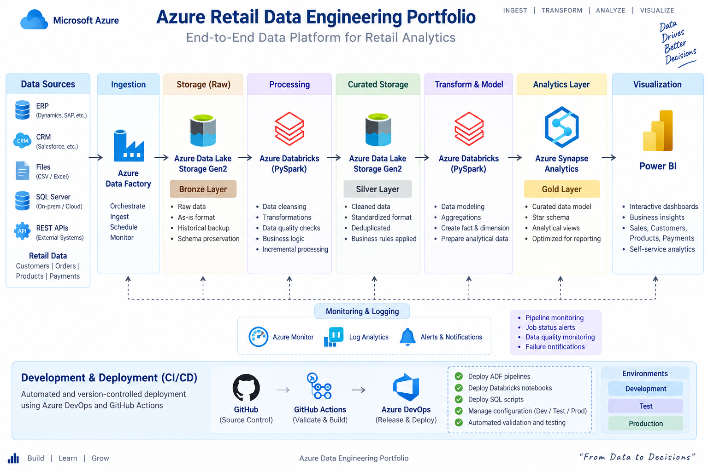

# Azure Retail Data Engineering Portfolio

An end-to-end Azure Data Engineering project demonstrating a modern cloud data platform for retail analytics.

## Project Overview

This project demonstrates how retail data can be ingested, stored, transformed, validated, modeled, and served for analytics and reporting.

The solution follows a Medallion Architecture:

**Bronze → Silver → Gold → Analytics → Reporting**

The project uses Azure Data Factory for orchestration, Azure Data Lake Storage Gen2 for scalable storage, PySpark for data transformation, Azure Synapse Analytics for analytical serving, and Power BI for reporting.

---

## Architecture



### End-to-End Data Flow

**Source Systems**
- ERP systems
- CRM systems
- SQL Server
- CSV / Excel files
- REST APIs

↓

**Azure Data Factory**

- Data ingestion
- Pipeline orchestration
- Scheduling
- Incremental loading
- Monitoring

↓

**Azure Data Lake Storage Gen2**

### Bronze Layer
- Raw source data
- Original file format preserved
- Historical backup
- Schema preservation

↓

**Azure Databricks / PySpark**

### Silver Layer
- Data cleansing
- Deduplication
- Data quality validation
- Standardization
- Business rules

↓

**Azure Data Lake Storage Gen2**

### Gold Layer
- Curated business data
- Aggregations
- Fact and dimension datasets
- Analytics-ready data

↓

**Azure Synapse Analytics**

- Analytical views
- SQL-based reporting layer
- Optimized analytical queries

↓

**Power BI**

- Business dashboards
- KPI reporting
- Retail analytics

---

## Technology Stack

| Technology | Purpose |
|---|---|
| Azure Data Factory | Data ingestion and orchestration |
| Azure Data Lake Storage Gen2 | Scalable cloud data storage |
| Azure Databricks | Distributed data processing |
| PySpark | Data transformation |
| Delta Lake | Reliable data storage and processing |
| Azure Synapse Analytics | Analytical serving layer |
| SQL | Data transformation and analytics |
| Power BI | Reporting and visualization |
| Azure DevOps | CI/CD and source control |
| GitHub Actions | Automated validation |

---

## Medallion Architecture

### Bronze Layer

The Bronze layer stores raw data received from source systems.

Key characteristics:

- Raw data is preserved
- Minimal transformation
- Historical data retention
- Supports data recovery and reprocessing

### Silver Layer

The Silver layer contains cleaned and standardized data.

Key processing includes:

- Removing duplicates
- Handling null values
- Data type standardization
- Data quality checks
- Applying business rules
- Data cleansing

### Gold Layer

The Gold layer contains curated data optimized for analytics.

Key processing includes:

- Business aggregations
- Fact and dimension modeling
- Analytical datasets
- Reporting-ready data

---

## Data Sources

The project uses sample retail datasets representing:

- Customers
- Products
- Orders
- Payments

Sample data is available in the `data/` directory.

---

## Incremental Load Strategy

The solution uses an incremental loading approach instead of processing the complete dataset every time.

A watermark such as a last modified timestamp can be used to identify newly added or modified records.

Example:

```sql
SELECT *
FROM source_table
WHERE last_modified_date > @watermark;
````

This approach helps reduce unnecessary data movement and improves pipeline efficiency.

The incremental load strategy is documented in:

`adf/incremental_load.md`

---

## Data Quality

Data quality checks are applied during the transformation process.

Examples include:

* Null value validation
* Duplicate record detection
* Required column validation
* Data type validation
* Record count checks
* Business rule validation

Implementation:

`pyspark/data_quality_checks.py`

---

## PySpark Processing

The project includes PySpark pipelines for moving data through the Medallion layers.

### Bronze → Silver

`pyspark/bronze_to_silver.py`

Responsibilities include:

* Reading raw data
* Cleaning records
* Removing duplicates
* Applying transformations
* Performing data quality checks
* Writing curated Silver data

### Silver → Gold

`pyspark/silver_to_gold.py`

Responsibilities include:

* Reading Silver datasets
* Applying business transformations
* Creating analytical datasets
* Performing aggregations
* Preparing fact and dimension data

---

## SQL Analytics

SQL scripts are organized under:

`sql/`

### SQL components

* Table creation
* Data transformations
* Analytical queries

Files:

* `01_create_tables.sql`
* `02_transformations.sql`
* `03_analytics.sql`

The analytics layer demonstrates SQL techniques such as:

* Aggregations
* Joins
* Window functions
* Filtering
* Business KPIs

---

## Azure Data Factory

ADF is used as the orchestration layer.

The pipeline design includes:

* Source ingestion
* Incremental loading
* Pipeline parameters
* Data movement
* Transformation orchestration
* Monitoring and failure handling

ADF documentation:

`adf/README.md`

Pipeline definition:

`adf/pipeline_retail_data.json`

---

## Azure Synapse Analytics

Azure Synapse acts as the analytical serving layer.

The project contains analytical views designed to expose curated Gold-layer data for reporting.

Synapse implementation:

`synapse/01_create_views.sql`

Documentation:

`synapse/README.md`

---

## Power BI Reporting

Power BI consumes curated analytical data from Azure Synapse Analytics.

The reporting layer is designed to provide:

* Retail KPIs
* Customer analysis
* Product performance
* Order analysis
* Payment analysis
* Business reporting

Documentation:

`powerbi/README.md`

---

## CI/CD

Azure DevOps and GitHub Actions are used to demonstrate CI/CD practices.

The CI workflow performs automated validation whenever changes are pushed to the repository.

GitHub Actions workflow:

`.github/workflows/ci.yml`

Azure DevOps documentation:

`devops/README.md`

Pipeline configuration:

`devops/azure-pipelines.yml`

---

## Repository Structure

```text
azure-data-engineering-portfolio/
│
├── .github/
│   └── workflows/
│       └── ci.yml
│
├── adf/
│   ├── README.md
│   ├── incremental_load.md
│   └── pipeline_retail_data.json
│
├── architecture/
│   ├── Architecture.png
│   ├── README.md
│   └── architecture.md
│
├── data/
│   ├── customers.csv
│   ├── orders.csv
│   ├── payments.csv
│   ├── products.csv
│   └── data_dictionary.md
│
├── devops/
│   ├── README.md
│   └── azure-pipelines.yml
│
├── powerbi/
│   └── README.md
│
├── pyspark/
│   ├── bronze_to_silver.py
│   ├── data_quality_checks.py
│   ├── silver_to_gold.py
│   └── README.md
│
├── sql/
│   ├── 01_create_tables.sql
│   ├── 02_transformations.sql
│   ├── 03_analytics.sql
│   └── README.md
│
├── synapse/
│   ├── 01_create_views.sql
│   └── README.md
│
└── README.md
```

---

## Key Data Engineering Concepts Demonstrated

* End-to-end Azure Data Engineering
* Medallion Architecture
* ETL / ELT
* Incremental data loading
* Data quality validation
* Data cleansing
* Deduplication
* PySpark transformations
* SQL analytics
* Fact and dimension modeling
* Analytical views
* Cloud data lake architecture
* Pipeline orchestration
* CI/CD
* Source control
* Monitoring and validation

---

## Project Outcome

This portfolio demonstrates the design of a modern Azure-based data engineering solution covering the complete data lifecycle:

**Ingestion → Storage → Transformation → Data Quality → Modeling → Analytics → Reporting → CI/CD**

The project is structured to demonstrate practical data engineering concepts using commonly used Azure services and open-source development practices.

```

